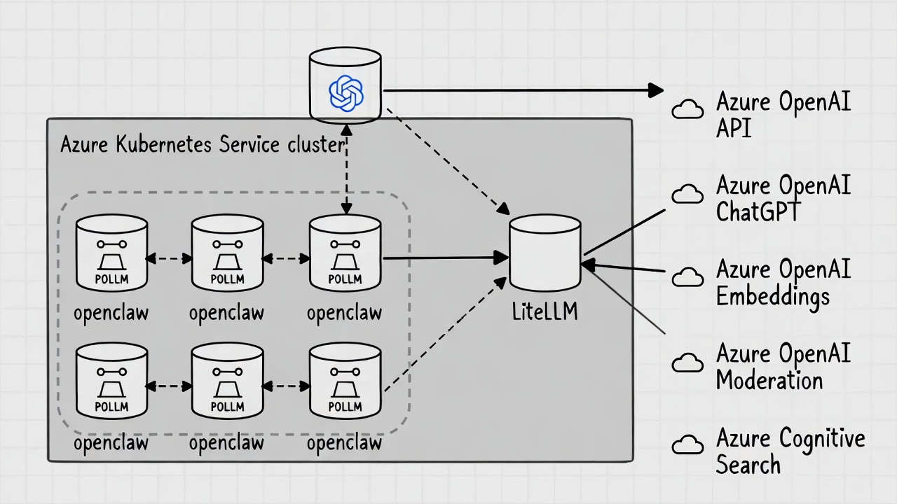
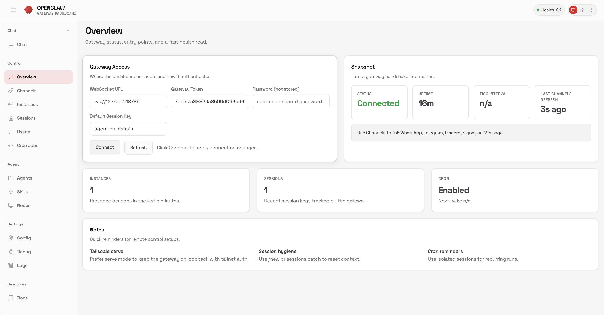
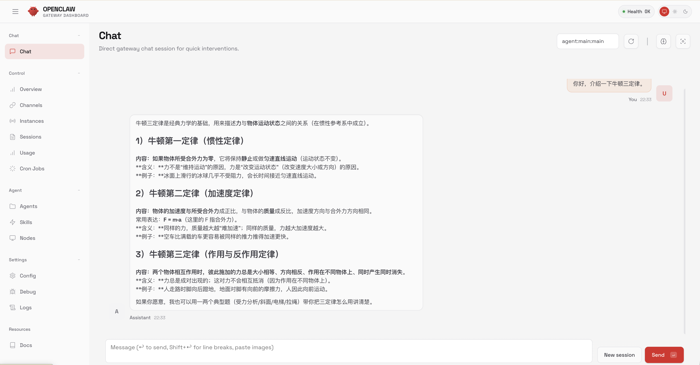
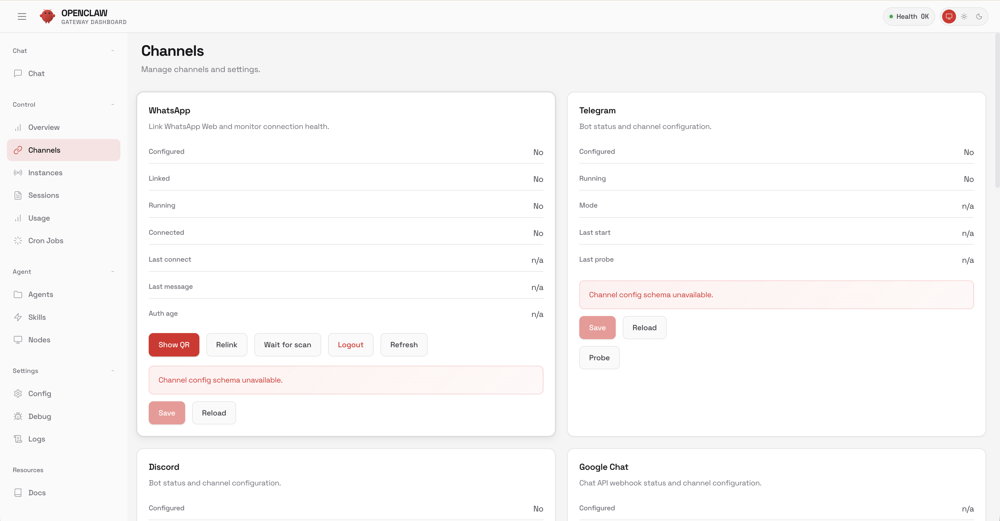

# OpenClaw on Azure AKS 部署指南

本指南将帮助你在 Azure Kubernetes Service (AKS) 上一键部署 OpenClaw，并配置其使用 LiteLLM 作为代理来连接 Azure OpenAI 服务。

## 📋 目录

- [部署架构](#部署架构)
- [前置条件](#前置条件)
- [1. 准备 Azure OpenAI 资源](#1-准备-azure-openai-资源)
- [2. 配置项目](#2-配置项目)
- [3. 执行部署](#3-执行部署)
- [4. 访问 Control UI](#4-访问-control-ui)
- [5. 验证与测试](#5-验证与测试)

---

## 部署架构




### OpenClaw on AKS 部署架构

该方案通过自动化脚本在 Azure Kubernetes Service (AKS) 上构建了一套包含 AI 代理网关和核心业务平台的完整微服务架构。

#### 1. 基础设施层 (Infrastructure)
*   **Azure 资源组**: 所有资源被封装在一个独立的资源组中（默认为 `<DEPLOY_NAME>-RG`）。
*   **计算集群 (AKS)**: 部署了一个单节点（规格 `Standard_D2s_v5`）的 AKS 集群，启用托管标识 (Managed Identity) 以简化权限管理。
*   **命名空间隔离**: 所有应用组件均部署在专用的 `openclaw-ns` Kubernetes 命名空间中，与其他系统隔离。

#### 2. 核心组件层 (Components)

架构由两个主要的工作负载组成，它们通过 Kubernetes 内部网络协同工作：

*   **LLM 代理网关 (LiteLLM Proxy)**
    *   **角色**: 负责将 Azure OpenAI 的专有 API 协议转换为标准的 OpenAI 兼容格式，作为 OpenClaw 与底层模型之间的适配器。
    *   **配置**: 通过 `ConfigMap` 挂载 `litellm-config.yaml`，自动读取并配置 Azure OpenAI 的 Endpoint 和 Key。
    *   **安全**: 使用启动时生成的随机 `MASTER_KEY` 进行 API 调用认证。
    *   **网络**: 通过名为 `*-llmproxy-svc` 的 Service (LoadBalancer) 暴露在集群内部端口 4000。

*   **OpenClaw 核心平台**
    *   **角色**: 提供 AI 代理编排、Control UI 和业务逻辑处理。
    *   **配置**: 通过 `ConfigMap` 挂载 `openclaw-config.json`，配置文件中硬编码了指向 LiteLLM Proxy 的集群内部 DNS 地址（例如 `http://<name>-llmproxy-svc.openclaw-ns.svc.cluster.local:4000/v1`），确保流量不经过公网。
    *   **存储**: 使用 `emptyDir` 卷挂载 `/home/node/.openclaw`，用于存放运行时的临时数据（注意：Pod 重启后数据会重置）。
    *   **网络**: 通过名为 `*-svc` 的 Service (LoadBalancer) 暴露，将容器端口 18789 映射为服务端口 80。

#### 3. 访问与安全 (Access & Security)

*   **用户访问链路**:
    *   由于 OpenClaw Control UI 依赖 WebCrypto API（要求 HTTPS 或 localhost 环境），架构设计上推荐使用 **Localhost 隧道**。
    *   用户 -> `kubectl port-forward` (本地 18789) -> OpenClaw Service (集群内)。
    *   访问受随机生成的 `OPENCLAW_TOKEN` 保护。

*   **AI 调用链路**:
    *   OpenClaw -> (集群内网) -> LiteLLM Proxy -> (公网 HTTPS) -> Azure OpenAI Service。

这个架构实现了**配置即代码**（所有配置通过 ConfigMap 注入）和**零信任网络**（内部组件间通过 Token 认证，外部访问通过端口转发加密隧道）。


## 前置条件

在开始之前，请确保你的本地环境已安装以下工具：

1.  **Azure CLI** (`az`)  
    [安装指南](https://learn.microsoft.com/zh-cn/cli/azure/install-azure-cli) - 用于管理 Azure 资源。
    *   安装后请运行 `az login` 登录。

2.  **Kubernetes CLI** (`kubectl`)  
    [安装指南](https://kubernetes.io/docs/tasks/tools/) - 用于管理 Kubernetes 集群。

3.  **Bash 环境** (macOS/Linux) 或 **PowerShell** (Windows)

4.  **jq**
    [安装指南](https://jqlang.github.io/jq/download/) - 用于处理 JSON 数据。macOS 用户可使用 `brew install jq` 安装。

---

## 1. 准备 Azure OpenAI 资源

OpenClaw 需要大语言模型支持。我们需要先在 Azure 上创建一个 OpenAI 资源。

1.  访问 [Azure Portal](https://portal.azure.com/)。
2.  创建 **Azure OpenAI** 资源。
    *   [微软官方文档：创建和部署 Azure OpenAI 服务资源](https://learn.microsoft.com/zh-cn/azure/ai-services/openai/how-to/create-resource?pivots=web-portal)
3.  在 Azure OpenAI Studio 中部署一个模型（推荐 **gpt-4o** 或 **gpt-5.2**）。
    *   记住你的 **部署名称 (Deployment Name)**，后续配置需要用到。

---

## 2. 配置项目

1.  进入项目目录：
    ```bash
    cd aks
    ```

2.  编辑 `azure-openai.json` 文件：
    ```json
    {
      "apiVersion": "2024-02-15-preview",  // 你的 Azure OpenAI API 版本
      "deploymentName": "gpt-5.2",         // 你在 Azure OpenAI Studio 中创建的部署名称
      "azureOpenAI": [
        {
          "name": "eastus2",
          "endpoint": "https://<your-resource-name>.openai.azure.com/",
          "key": "<your-api-key>"
        }
      ]
    }
    ```
    *   `endpoint`: 你的 Azure OpenAI 资源端点 URL。
    *   `key`: 你的 Azure OpenAI API 密钥（Key 1 或 Key 2）。
    *   LiteLLM 支持配置多个 Azure OpenAI 资源进行负载平衡。

---

## 3. 执行部署

根据你的操作系统选择相应的脚本。

### macOS / Linux (Bash)

```bash
# 添加执行权限
chmod +x deploy-openclaw-aks.sh

# 运行部署脚本
# 参数: ./deploy-openclaw-aks.sh <部署名称> <区域> <模型显示名称>
./deploy-openclaw-aks.sh openclaw eastus2 gpt-5.2
```

### Windows (PowerShell)

在 PowerShell 终端中运行：

```powershell
.\deploy-openclaw-aks.ps1 -DeployName "openclaw" -Region "eastus2" -ModelName "gpt-5.2"
```

**脚本会自动执行以下操作：**
1.  检查工具依赖。
2.  生成随机的安全密钥 (Master Key 和 Gateway Token)。
3.  创建资源组和 AKS 集群（如果是首次运行，耗时约 5-10 分钟）。
4.  部署 LiteLLM（作为 Azure OpenAI 的代理）。
5.  部署 OpenClaw，并自动配置连接到 LiteLLM。

---

## 4. 访问 Control UI

由于浏览器对非 HTTPS 网站的安全限制（禁止使用 WebCrypto API），直接通过 IP 访问 OpenClaw Control UI 会导致报错。我们需要通过 **端口转发** 将服务映射到本地。

1.  **保持连接**：
    在部署脚本执行完毕后，它会提示你运行一条命令。请复制并在终端中运行它（保持终端开启）：

    ```bash
    kubectl port-forward service/openclaw-svc 18789:80 -n openclaw-ns
    ```

2.  **打开浏览器**：
    访问以下地址（脚本结束时会显示带有 Token 的完整链接）：

    **`http://127.0.0.1:18789/?token=<YOUR_TOKEN>`**

    *   Token 可以在脚本输出中找到，或者查看生成的 `.secrets` 文件。

---

## 5. 验证与测试

1.  **进入 Overview 界面**：
    在 Control UI 左侧菜单点击 **Overview**。在 Access Token 中输入 Token 串。
    

2.  **进入 Chat 界面**：
    在 Control UI 左侧菜单点击 **Chat**。

3.  **发送消息**：
    在对话框中输入测试消息，例如 "Hello"。

4.  **确认响应**：
    如果 OpenClaw 成功回复，说明连接链路（OpenClaw -> LiteLLM -> Azure OpenAI）工作正常。
    

4.  **设置 Channel**：
    在 Control UI 左侧菜单点击 **Channel**。输入对应社交媒体 App 的 credential 和 url，确保 openclaw 连接社交媒体。
    

### 常见问题排查

*   **报错 "device identity required"**：
    *   原因：你可能使用了直接 IP 访问（http://130.x.x.x）。
    *   解决：请务必使用 `kubectl port-forward` 并通过 `http://127.0.0.1:18789` 访问。

*   **Chat 页面无响应或报错**：
    *   检查 LiteLLM 日志：`kubectl logs -l app=openclaw-llmproxy -n openclaw-ns`
    *   确认 `azure-openai.json` 中的 API Key 和 Endpoint 是否正确。
