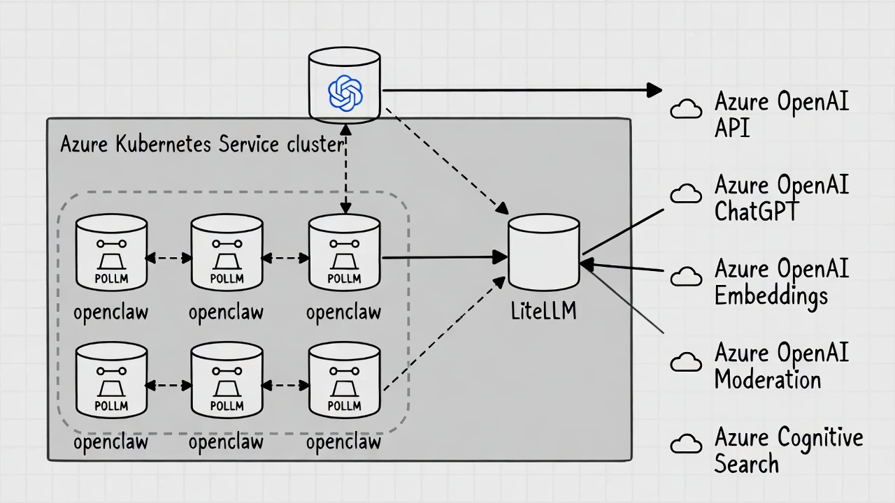
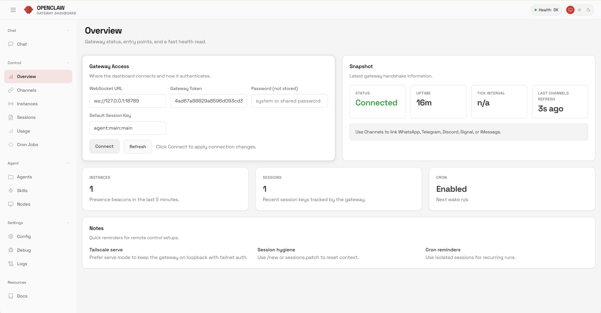
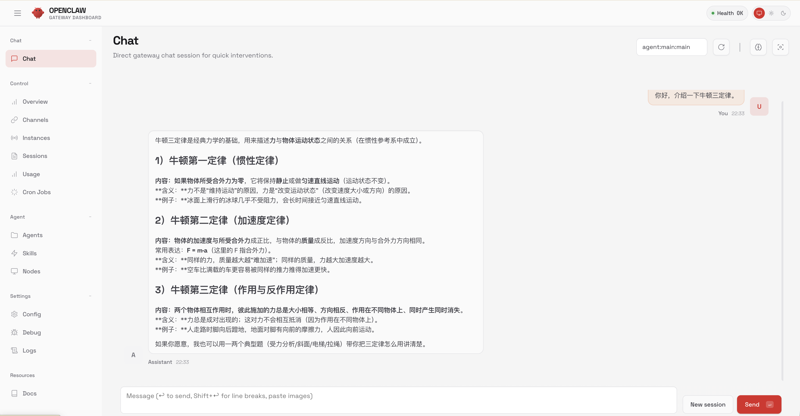
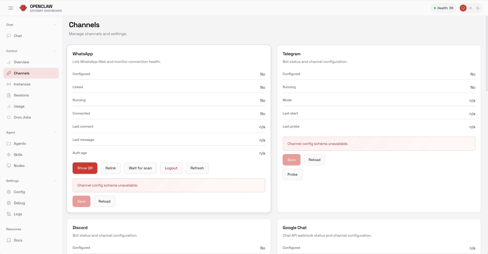

# OpenClaw on AKS 部署指南 (v2.0)

本指南将帮助你在 Azure Kubernetes Service (AKS) 上一键部署 OpenClaw，并配置其使用 LiteLLM 作为代理来连接 Azure OpenAI 服务。

## 📋 目录

- [部署架构](#部署架构)
- [架构特点](#架构特点)
- [前置条件](#前置条件)
- [1. 准备 Azure OpenAI 资源](#1-准备-azure-openai-资源)
- [2. 配置项目](#2-配置项目)
- [3. 执行部署](#3-执行部署)
- [4. 访问 Control UI](#4-访问-control-ui)
- [5. 验证与测试](#5-验证与测试)
- [6. 成本估算](#6-成本估算)

---

## 部署架构



### OpenClaw on AKS 部署架构

该方案通过自动化脚本在 Azure Kubernetes Service (AKS) 上构建了一套包含 AI 代理网关和核心业务平台的完整微服务架构。

#### 1. 基础设施层 (Infrastructure)
*   **Azure 资源组**: 所有资源被封装在一个独立的资源组中（默认为 `<DEPLOY_NAME>-RG`）。
*   **计算集群 (AKS)**: 部署了一个单节点（规格 `Standard_D2s_v5`）的 AKS 集群，启用托管标识 (Managed Identity) 以简化权限管理。
*   **命名空间隔离**: 所有应用组件均部署在专用的 `openclaw-ns` Kubernetes 命名空间中，与其他系统隔离。

#### 2. 核心组件层 (Components)

架构由两个主要的工作负载组成，它们通过 Kubernetes 内部网络协同工作：

*   **LLM 代理网关 (LiteLLM Proxy)**
    *   **角色**: 负责将 Azure OpenAI 的专有 API 协议转换为标准的 OpenAI 兼容格式，作为 OpenClaw 与底层模型之间的适配器。
    *   **配置**: 通过 `ConfigMap` 挂载 `litellm-config.yaml`，自动读取并配置 Azure OpenAI 的 Endpoint 和 Key。
    *   **安全**: 使用启动时生成的随机 `MASTER_KEY` 进行 API 调用认证。
    *   **网络**: 通过名为 `*-llmproxy-svc` 的 Service (LoadBalancer) 暴露在集群内部端口 4000。

*   **OpenClaw 核心平台**
    *   **角色**: 提供 AI 代理编排、Control UI 和业务逻辑处理。
    *   **配置**: 通过 `ConfigMap` 挂载 `openclaw-config.json`，配置文件中硬编码了指向 LiteLLM Proxy 的集群内部 DNS 地址（例如 `http://<name>-llmproxy-svc.openclaw-ns.svc.cluster.local:4000/v1`），确保流量不经过公网。
    *   **存储**: 使用 `emptyDir` 卷挂载 `/home/node/.openclaw`，用于存放运行时的临时数据（注意：Pod 重启后数据会重置）。
    *   **网络**: 通过名为 `*-svc` 的 Service (LoadBalancer) 暴露，将容器端口 18789 映射为服务端口 80。

#### 3. 访问与安全 (Access & Security)

*   **用户访问链路**:
    *   由于 OpenClaw Control UI 依赖 WebCrypto API（要求 HTTPS 或 localhost 环境），架构设计上推荐使用 **Localhost 隧道**。
    *   用户 -> `kubectl port-forward` (本地 18789) -> OpenClaw Service (集群内)。
    *   访问受随机生成的 `OPENCLAW_TOKEN` 保护。

*   **AI 调用链路**:
    *   OpenClaw -> (集群内网) -> LiteLLM Proxy -> (公网 HTTPS) -> Azure OpenAI Service。

---

## 🌟 架构特点 (Architecture Highlights)

本方案采用全自动化 Python 脚本 (`deploy_openclaw.py`) 进行部署，具有以下核心特点：

1.  **零密钥管理 (Managed Identity)**:
    *   **安全增强**: 完全摒弃了在配置文件或环境变量中存储 Azure OpenAI API Key 的做法。
    *   **身份认证**: 利用 Azure **User Assigned Managed Identity** (用户分配的托管标识) 自动获取 Entra ID Token。
    *   **RBAC 控制**: 脚本自动为托管标识分配 `Cognitive Services OpenAI User` 角色，实现最小权限原则。

2.  **动态代理层 (LiteLLM Proxy)**:
    *   **统一接口**: LiteLLM Proxy 将 Azure OpenAI 的特定 API 转换为标准的 OpenAI 兼容接口，使 OpenClaw 可以直接使用。
    *   **自定义注入**: 使用自定义 Python 启动脚本 (`run_proxy.py`)，在运行时动态注入 Azure Token Provider，确保 Token 自动刷新。
    *   **智能路由**: 支持多区域/多资源的 Azure OpenAI 负载均衡（配置在 `azure-openai.json` 中）。

3.  **Kubernetes 原生集成**:
    *   **Secret 管理**: 自动生成并存储 `Master Key` 和 `OpenClaw Token` 到 K8s Secret 中。后续部署自动复用，无需本地文件。
    *   **配置注入**: 所有配置通过 ConfigMap 挂载，支持热更新（需重启 Pod）。
    *   **服务发现**: OpenClaw 通过 K8s 内部 DNS (`http://openclaw-llmproxy-svc...`) 直接访问代理层，流量不经过公网。

---

## 前置条件

在开始之前，请确保你的本地环境已安装以下工具：

1.  **Azure CLI** (`az`)  
    *   [安装指南](https://learn.microsoft.com/zh-cn/cli/azure/install-azure-cli) - 用于管理 Azure 资源。
    *   安装后请运行 `az login` 登录。

2.  **Kubernetes CLI** (`kubectl`)  
    *   [安装指南](https://kubernetes.io/docs/tasks/tools/) - 用于管理 Kubernetes 集群。

3.  **Python 3.8+**
    *   安装依赖:
        ```bash
        pip install azure-identity azure-mgmt-resource azure-mgmt-containerservice azure-mgmt-compute azure-mgmt-msi azure-mgmt-authorization azure-mgmt-cognitiveservices kubernetes
        ```

---

## 1. 准备 Azure OpenAI 资源

OpenClaw 需要大语言模型支持。我们需要先在 Azure 上创建一个 OpenAI 资源。

1.  访问 [Azure Portal](https://portal.azure.com/)。
2.  创建 **Azure OpenAI** 资源。
    *   [微软官方文档：创建和部署 Azure OpenAI 服务资源](https://learn.microsoft.com/zh-cn/azure/ai-services/openai/how-to/create-resource?pivots=web-portal)
3.  在 Azure OpenAI Studio 中部署一个模型（推荐 **gpt-4o** 或 **gpt-5.2**）。
    *   记住你的 **部署名称 (Deployment Name)**，后续配置需要用到。

---

## 2. 配置项目

1.  进入 `aks` 目录：
    ```bash
    cd aks
    ```

2.  编辑或创建 `azure-openai.json` 文件：
    ```json
    {
      "deployName": "openclaw",
      "region": "eastus2",
      "deploymentName": "gpt-5.2",         // 在 Azure OpenAI Studio 中创建的部署名称
      "apiVersion": "2024-02-15-preview",  // 你的 Azure OpenAI API 版本
      "azureOpenAI": [
        {
          "name": "resource-name-1",
          "endpoint": "https://resource-name-1.openai.azure.com/",
          "resource_group": "MyResourceGroup"
          // 注意：此处无需配置 "key"，脚本会自动使用 Managed Identity
        },
        {
          "name": "resource-name-2",
          "endpoint": "https://resource-name-2.openai.azure.com/",
          "resource_group": "MyResourceGroup" 
          // 可选: "subscription_id": "xxx" 如果资源在不同订阅下
        }
      ]
    }
    ```
    *   `endpoint`: 你的 Azure OpenAI 资源端点 URL。
    *   `resource_group`: 资源所在的 Azure 资源组。
    *   LiteLLM 支持配置多个 Azure OpenAI 资源进行负载平衡。

---

## 3. 执行部署

使用 Python 脚本执行一键部署。

```bash
# 确保在 aks 目录下
cd aks

# 运行部署脚本
python3 deploy_openclaw.py --config azure-openai.json
```

**脚本会自动执行以下操作：**
1.  **基础设施**: 创建资源组、AKS 集群和用户分配的托管标识 (Managed Identity)。
2.  **授权**: 为托管标识分配 Azure OpenAI 的 `Cognitive Services OpenAI User` 角色。
3.  **配置**: 生成 K8s Secret (Master Key, OpenClaw Token) 和 ConfigMaps。
4.  **部署**: 应用 K8s Manifests，启动 LiteLLM Proxy 和 OpenClaw 服务。

---

## 4. 访问 Control UI

由于 OpenClaw Control UI 依赖 WebCrypto API（要求 HTTPS 或 localhost 环境），直接通过 Cluster IP 访问会导致功能不可用。我们需要通过 **端口转发** 将服务映射到本地。

1.  **建立本地隧道**：
    在部署脚本执行完毕后，请在终端中运行（保持终端开启）：

    ```bash
    kubectl port-forward service/openclaw-svc 18789:80 -n openclaw-ns
    ```
    
    > **注意**: 如果你在 `azure-openai.json` 中修改了 `deployName` (默认为 `openclaw`)，请将命令中的 `openclaw-svc` 替换为 `<你的部署名>-svc`。
    > **提示**: 这会将 Kubernetes 集群中的服务端口 80 映射到你本地电脑的 18789 端口。

2.  **获取 Token**：
    你需要获取部署时生成的 Token。
    ```bash
    # 查看 Secret 内容
    kubectl get secret openclaw-secrets -n openclaw-ns -o jsonpath='{.data.openclaw_token}' | base64 -d
    ```
    或者直接在 Kubernetes Dashboard 中查看 `openclaw-secrets`。

3.  **打开浏览器**：
    访问以下地址：

    **`http://127.0.0.1:18789/?token=<YOUR_TOKEN>`**

---

## 5. 验证与测试

1.  **进入 Overview 界面**：
    在 Control UI 左侧菜单点击 **Overview**。如果在 Access Token 中输入了正确的 Token 串，应该显示“Gateway Connected”。
    

2.  **进入 Chat 界面**：
    在 Control UI 左侧菜单点击 **Chat**。

3.  **发送消息**：
    在对话框中输入测试消息，例如 "Hello"。

4.  **确认响应**：
    如果 OpenClaw 成功回复，说明连接链路（OpenClaw -> LiteLLM -> Azure OpenAI）工作正常。
    

5.  **设置 Channel**：
    在 Control UI 左侧菜单点击 **Channel**。输入对应社交媒体 App 的 credential 和 url，确保 openclaw 连接社交媒体。
    

### 常见问题排查

*   **报错 "device identity required"**：
    *   原因：你可能使用了直接 IP 访问（http://20.x.x.x）。
    *   解决：请务必使用 `kubectl port-forward` 并通过 `http://127.0.0.1:18789` 访问。

*   **Chat 页面无响应或报错**：
    *   检查 LiteLLM 日志：`kubectl logs -l app=openclaw-llmproxy -n openclaw-ns -f`
    *   确认 Managed Identity 是否有对应 OpenAI 资源的权限（Role Assignments）。

---

## 6. 成本估算 (Cost Estimation)

以下成本基于 **East US 2** 区域，仅供参考 (按月计算，730小时)：

| 资源类型 | 规格 | 数量 | 预估成本 (月) | 说明 |
| :--- | :--- | :--- | :--- | :--- |
| **AKS Cluster** | Standard Tier (Base) | 1 | 免费 | 管理平面若不开启 SLA 保证则免费 |
| **VM Node** | **Standard_B2s** | 1 | ~$30.37 | 2 vCPU, 4GB RAM (适合测试/轻量级) |
| **Managed Disk** | P10 (128GB) | 1 | ~$5.89 | 节点系统盘 |
| **Public IP** | Standard | 1 | ~$3.65 | 用于 Load Balancer |
| **Load Balancer** | Standard | 1 | ~$18.00 | 数据处理费另计 |
| **总计** | | | **~$58 / 月** | 不包含 OpenAI 调用费用 |

> **节省成本提示**: 
> *   测试完成后，使用 `az group delete -n <DEPLOY_NAME>-RG` 删除整个资源组以停止计费。
> *   生产环境建议使用至少 `Standard_D2s_v5` (~$70/月) 以获得更好性能。

## 🛠️ 常见操作

*   **重启服务**:
    ```bash
    kubectl rollout restart deployment openclaw -n openclaw-ns
    ```
*   **查看日志**:
    ```bash
    # OpenClaw 日志
    kubectl logs -l app=openclaw -n openclaw-ns -f

    # LiteLLM Proxy 日志 (查看 Auth 注入情况)
    kubectl logs -l app=openclaw-llmproxy -n openclaw-ns -f
    ```
